# CodeArena

Desafios de programação ao vivo, no estilo Kahoot. O professor abre uma sala; os alunos entram com um código de 6 dígitos
e respondem **escrevendo código**. Uma **checklist automática** marca cada passo conforme o aluno escreve; quando todos os itens
obrigatórios estão concluídos, a resposta é enviada, o servidor valida de novo e concede XP por corretude e velocidade.

- Motor de checklist determinístico (`contains`, `regex`, `notContains`, `pluginRule`), o mesmo no navegador e no servidor.
- Multiplayer em tempo real (Socket.IO) com servidor como fonte oficial de tempo e pontuação.
- Arquitetura de plugins: `react-native` (preview em celular) e `backend-http` (cliente HTTP e validação por requisições).
- Questões de depuração: o aluno corrige um código com bug, com diff do que mudou e correção esperada em diff.
- Revisão da turma por item da checklist: o professor vê, ao vivo e no relatório, onde a turma travou.
- Importação/exportação de packs em JSON validados com Zod, editor manual com teste ao vivo e avisos de qualidade.
- Documentação para agentes de IA gerarem questões e plugins (`AGENTS.md`, `docs/agents/`).

## Veja uma aula em 65 segundos

[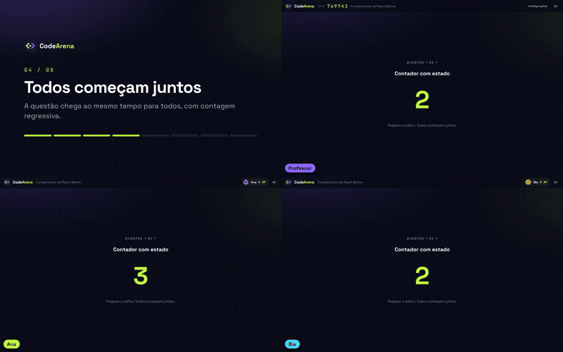](docs/public/videos/aula-demo.mp4)

Clique na imagem para ver o vídeo completo. Ele é gravado de uma sessão real com `pnpm demo:video`.

## Como funciona (telas)

Todas as imagens são geradas por uma sessão real com `pnpm screenshots` (ver [Atualizando as imagens](#atualizando-as-imagens)).

### Plugin `react-native`: checklist por AST e preview em celular

| Checklist parcial | Erro mostrado no preview |
| --- | --- |
| 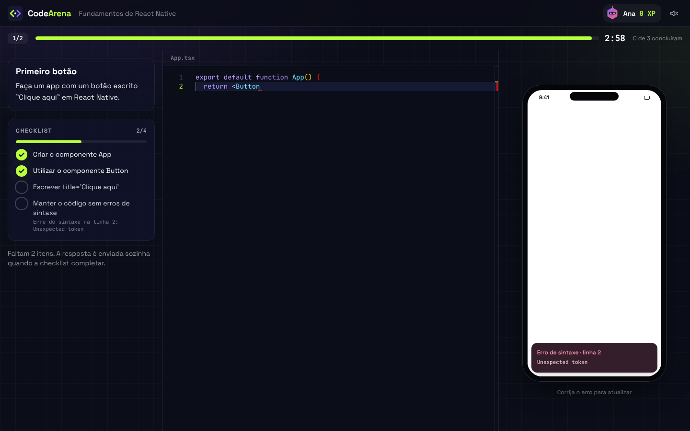 | 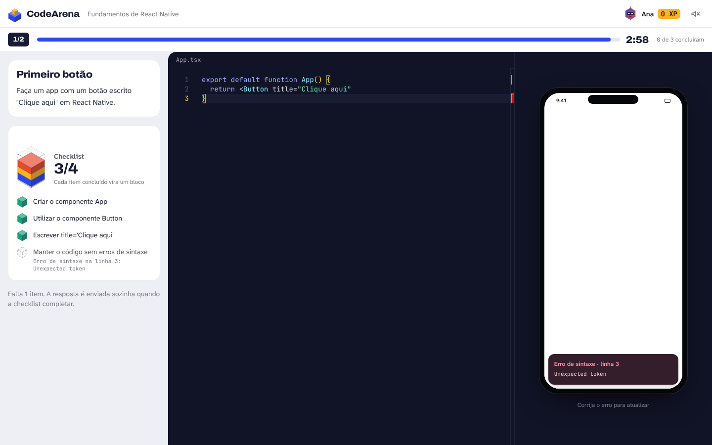 |
| Escrever `export default function App()` marca o item na hora. | Erro de sintaxe aparece no preview sem derrubar o app, e a checklist mostra a linha do erro. |

| Resposta aceita | Preview interativo com estado |
| --- | --- |
| 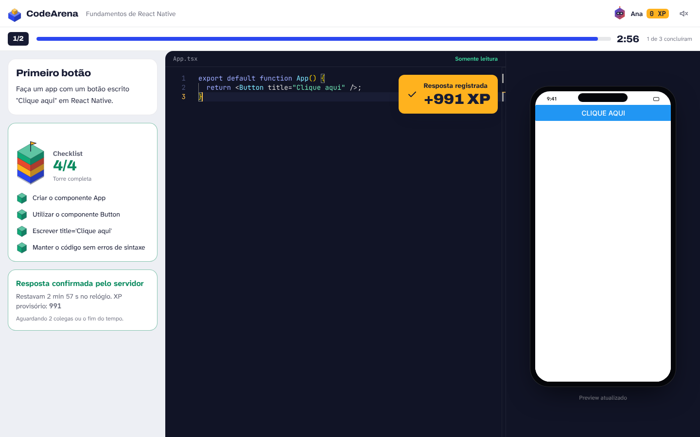 | 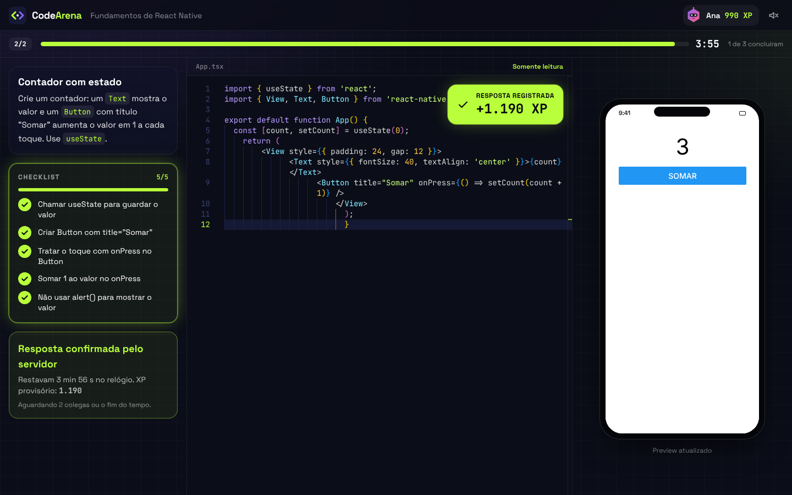 |
| Checklist completa: o servidor valida de novo, concede XP e trava o editor. | O preview executa o código do aluno (iframe isolado); aqui o botão foi tocado 3 vezes. |

### Plugin `backend-http`: cliente HTTP e validação por requisições

| Requisição falhando | Resposta aceita |
| --- | --- |
| 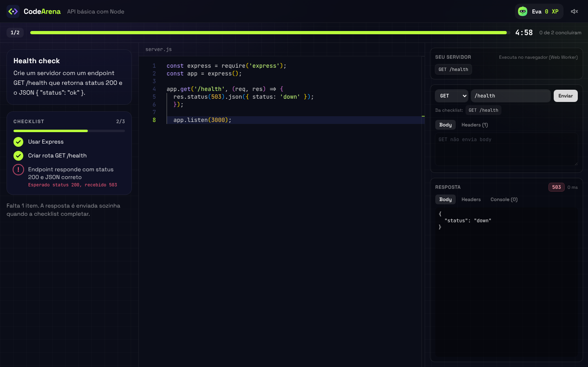 | 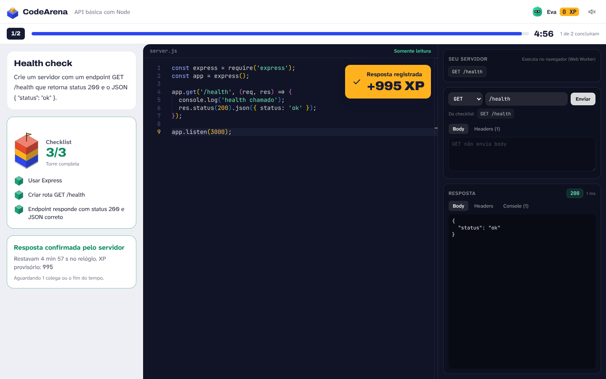 |
| O item dinâmico falha com a explicação ("Esperado status 200, recebido 503"). | Rotas detectadas, resposta (status, headers, body) e console do servidor do aluno. |

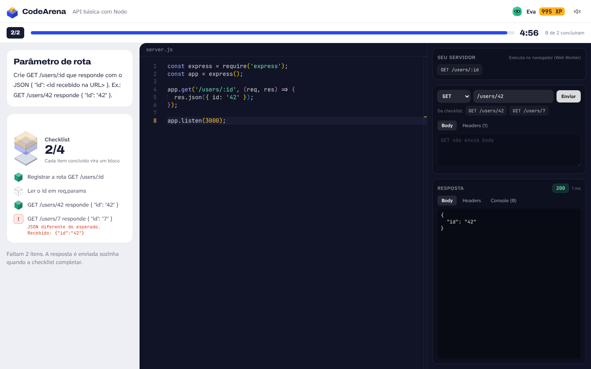

Uma resposta "decorada" (sempre `{ "id": "42" }`) passa em `/users/42`, mas falha em `/users/7`: a checklist testa comportamento, não só texto.

### Sala ao vivo

| Lobby do aluno | Lobby do professor |
| --- | --- |
| 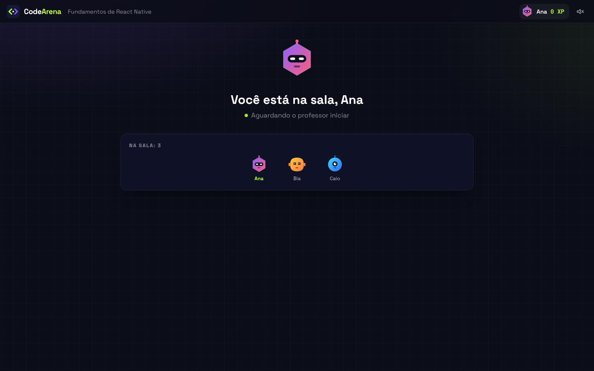 | 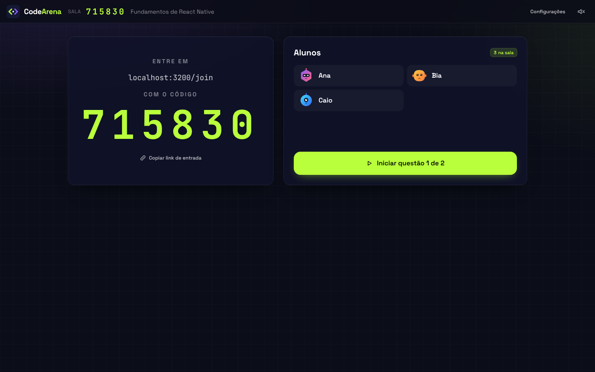 |

| Professor acompanhando | Placar do professor |
| --- | --- |
| 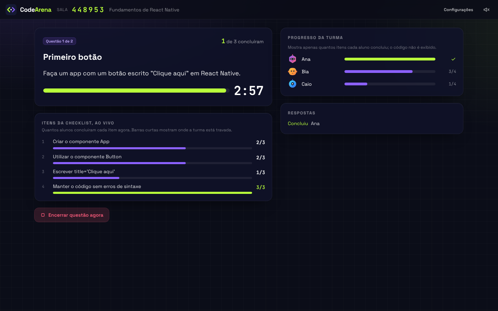 | 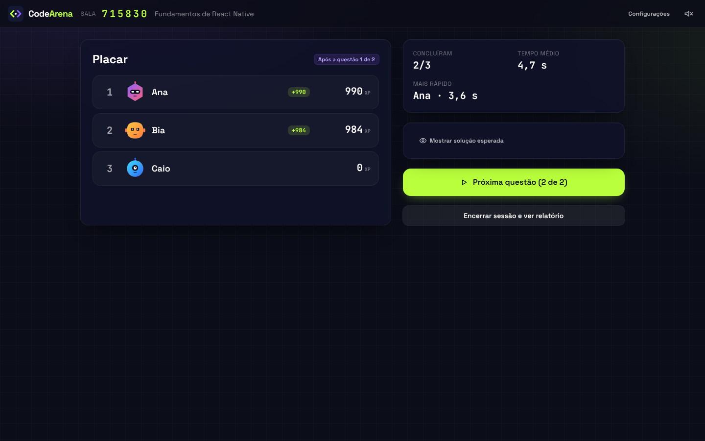 |

### Questões de depuração

| Código com bug | O que o aluno mudou |
| --- | --- |
| 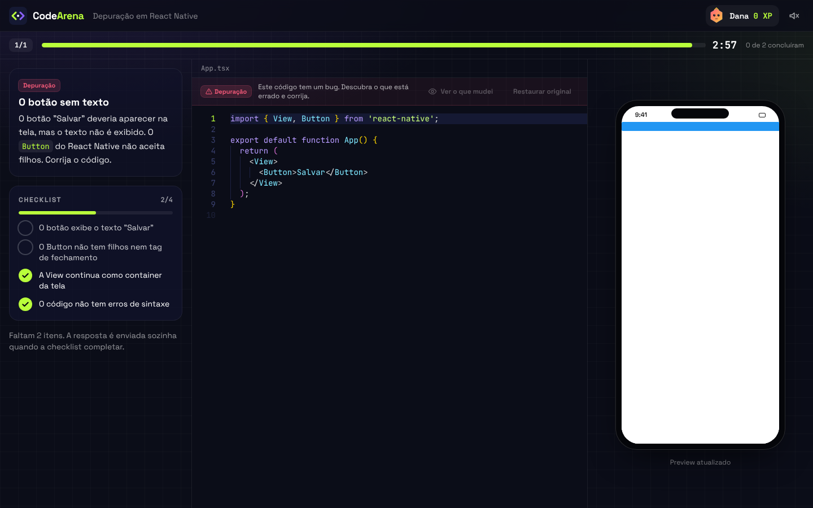 | 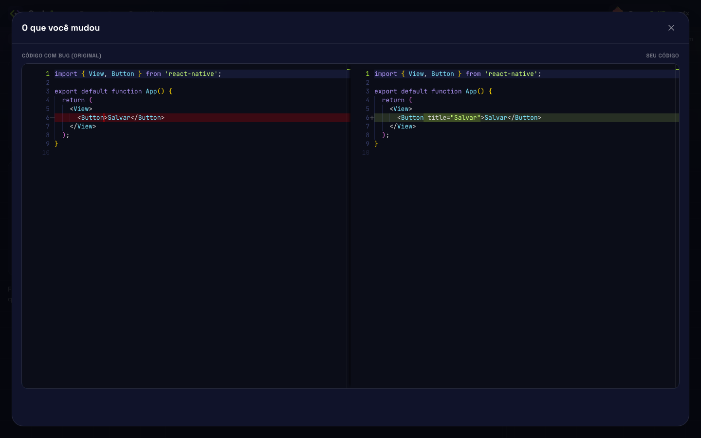 |

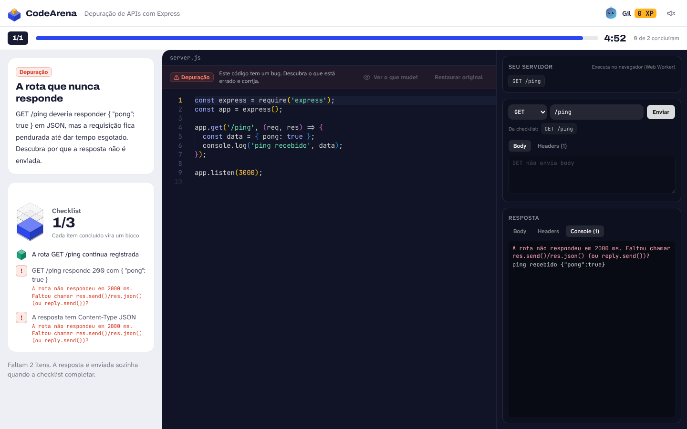

Guia: [`docs/agents/debug-questions.md`](docs/agents/debug-questions.md).

### Revisão da turma

| Itens ao vivo | Onde a turma travou |
| --- | --- |
|  | 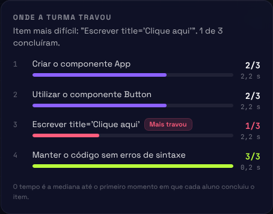 |

Mais telas: [`docs/images`](docs/images) (home, biblioteca, importação com erros, editor de questões, relatório final).

## Rodando localmente

Requisitos: **Node.js 22.13+** e **pnpm 10** (`corepack enable`).

```bash
pnpm install

# desenvolvimento: API + Socket.IO em :3001 e Vite em :5173 (com proxy)
pnpm dev
# abra http://localhost:5173

# produção: build do frontend + servidor único em :3000
pnpm build
pnpm start
# abra http://localhost:3000 (alunos na mesma rede usam o IP exibido no log)
```

Variáveis opcionais: `PORT`, `HOST`, `CODEARENA_DATA_DIR` (packs criados; padrão `./data`),
`CODEARENA_CONFIG` (lista de plugins; padrão `./codearena.config.json`), `CODEARENA_CONTENT_DIR` (pasta extra de packs
de exemplo da instalação, opcional), `CODEARENA_LOG=silent`.

## Usando

**Professor:** `/teacher` - importe um JSON ou crie um pack, clique em **Abrir sala**, projete o código, inicie as questões e
acompanhe o progresso. Ao final, exporte o relatório (CSV/JSON).

**Aluno:** `/join` - código da sala, nome e avatar. Responda no editor; a checklist marca sozinha e a resposta é enviada ao completar.

Packs de exemplo: `react-native-fundamentos.json` (5 questões), `backend-http-basico.json` (4) e, de depuração, `depuracao-react-native.json` e `depuracao-backend-http.json` (3 cada), distribuídos dentro dos plugins (`plugins/<id>/packs/`, listados no campo `codearena.packs` do `package.json`).

## Estrutura

```text
apps/
  server/          Fastify + Socket.IO, PackStore, validação oficial
  web/             React + Vite + Tailwind + Zustand + Framer Motion + Monaco
packages/
  schemas/         Zod do question pack e contratos de eventos
  plugin-sdk/      Contratos e registro de plugins
  core/            Checklist, XP, ranking, ciclo de vida da sala, lint de autoria
  plugin-host/     Lê codearena.config.json e carrega os plugins (servidor e build)
codearena.config.json  Plugins ativos nesta instalação
plugins/           (temporário: sairão para repositórios próprios, ver decisão 0001)
  react-native/    Validadores AST + preview isolado (react-native-web)
  backend-http/    Runtime Express + Worker + processo Node restrito + cliente HTTP
  */packs/         Packs de exemplo de cada plugin
docs/
  agents/          Instruções para agentes de IA gerarem conteúdo
  plugins/         Como criar plugins
  content/         Guia de autoria para professores
  architecture.md  Arquitetura, eventos, estados, segurança
e2e/               Testes Playwright dos fluxos críticos
scripts/           validate-packs
AGENTS.md
```

Detalhes em [`docs/architecture.md`](docs/architecture.md).

## Testes e qualidade

```bash
pnpm typecheck          # TypeScript estrito em todos os pacotes
pnpm test               # Vitest: schema, checklist, XP, ciclo da sala, plugins, servidor Socket.IO
pnpm test:e2e           # Playwright: build de produção + sala com 2 alunos, backend, importação
pnpm validate:packs     # valida os packs de exemplo dos plugins (ou arquivos passados) contra schema e solução
```

Para o Playwright usar um Chromium já instalado: `PLAYWRIGHT_CHROMIUM_PATH=/caminho/chromium pnpm test:e2e`.

### Atualizando as imagens

```bash
pnpm build
pnpm screenshots   # sobe um servidor temporário na porta 3200 e regrava docs/images/*.png
```

O script (`scripts/screenshots.mjs`) conduz uma sessão completa com Playwright; rode-o depois de mudar a interface.
Para regravar só algumas imagens: `SHOTS_ONLY="10-,14-" pnpm screenshots` (prefixos dos nomes de arquivo).
O vídeo da aula (`docs/public/videos/aula-demo.mp4` e o GIF) é regravado com `pnpm build && pnpm demo:video` (precisa de `ffmpeg` instalado).

## Site de documentação

Toda a documentação (`docs/`) também é um site, com a identidade visual do jogo, busca e navegação por perfil
(professores, agentes de IA, plugins, contribuição).

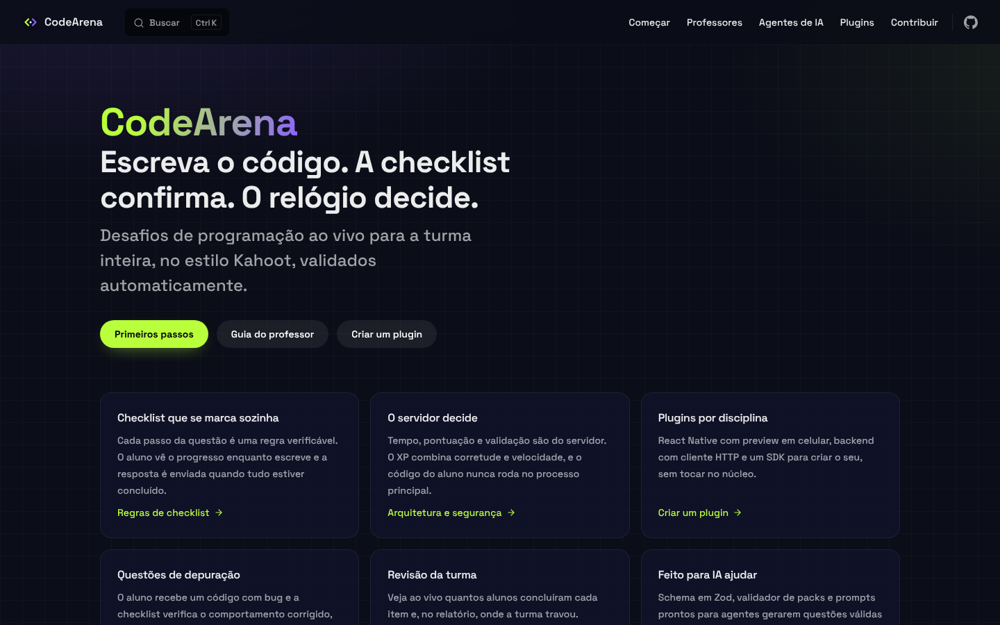

```bash
pnpm docs:dev       # http://localhost:5173 (ou a porta indicada), com atualização ao salvar
pnpm docs:build     # gera docs/.vitepress/dist
pnpm docs:preview   # serve o build
```

Publicação: o workflow `.github/workflows/docs.yml` publica no GitHub Pages a cada push em `main`. Ative uma vez em
**Settings > Pages > Source: GitHub Actions**. O endereço será `https://<usuario>.github.io/<repositorio>/`.

## Criando conteúdo com IA

Use os prompts de [`docs/agents/prompt-templates.md`](docs/agents/prompt-templates.md) com `AGENTS.md` e os guias de
`docs/agents/` como contexto, depois rode `pnpm validate:packs pack.json` ou importe pelo app.

## Núcleo, plugins e packs

- **Núcleo** (este repositório): sala em tempo real, checklist, XP, interface e o SDK de plugins.
- **Plugins**: pacotes npm separados, um por disciplina, ativados em `codearena.config.json`. Quem não usa um plugin não
  carrega as dependências dele. Oficiais: `react-native` e `backend-http` (Express).
- **Packs**: questões em JSON. Nunca contêm código; só apontam para um `pluginId`. Para usar um pack, o plugin dele
  precisa estar instalado no servidor. Passo a passo em
  [`docs/guia/plugins-e-packs.md`](docs/guia/plugins-e-packs.md).

Para ativar ou desativar um plugin, edite `codearena.config.json` e rode `pnpm build`. Cada interface de plugin só é
baixada quando uma questão dele é aberta. A migração continua: hoje os dois plugins ainda ficam em `plugins/`. Decisão, modelo alvo e
etapas em [`docs/decisoes/0001-plugins-como-pacotes.md`](docs/decisoes/0001-plugins-como-pacotes.md) e
[`docs/architecture.md`](docs/architecture.md#nucleo-plugins-e-packs). Para criar um plugin:
[`docs/plugins/creating-a-plugin.md`](docs/plugins/creating-a-plugin.md).

## Contribuindo

Contribuições de professores e desenvolvedores são bem-vindas: packs de questões, plugins de outras disciplinas, tradução e
acessibilidade. Veja o [`CONTRIBUTING.md`](CONTRIBUTING.md) e procure as issues com as labels
**`bom primeiro plugin`**, **`bom primeiro pack`** e **`good first issue`**. Participar significa seguir o
[Código de Conduta](CODE_OF_CONDUCT.md). Vulnerabilidades: [`SECURITY.md`](SECURITY.md).

## Limitações conhecidas do MVP

- Salas ficam em memória: reiniciar o servidor encerra as sessões em andamento (packs ficam salvos em disco).
- Sem autenticação de professor: quem cria a sala recebe um token guardado no navegador.
- O runner de backend executa o código do aluno com Express/Fastify compatíveis em memória (sem rede, banco ou arquivos).
  A validação oficial roda em processo Node isolado pelo modelo de permissões do Node, que não bloqueia rede de saída;
  em ambiente público, use contêiner sem rede.
- O preview React Native usa react-native-web; APIs nativas não estão disponíveis.

## Licença

MIT
