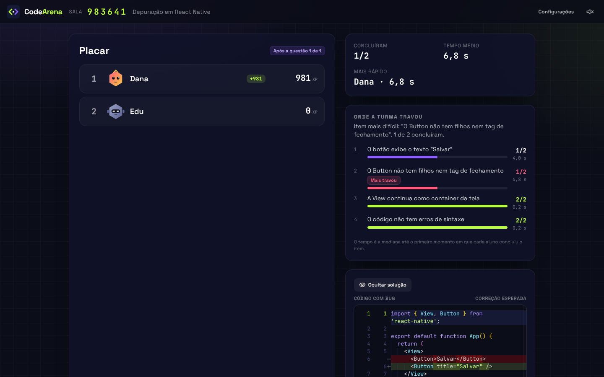

# Questões de depuração

Em vez de construir do zero, o aluno recebe um **código com bug** e precisa corrigi-lo. É o formato que melhor
mede compreensão: o aluno lê, formula uma hipótese, testa e confirma. Declare com `"kind": "debug"`.


## O que muda em relação a uma questão comum

| | `build` (padrão) | `debug` |
| --- | --- | --- |
| `starterCode` | ponto de partida, pode ficar vazio | **obrigatório**: o código com bug |
| Checklist | passos para construir | **comportamento esperado** depois da correção |
| Itens já concluídos no início | evitar | esperado: são os itens de "não quebrar o que funciona" |
| Aviso "o código inicial já satisfaz o item" | sim | não se aplica |
| Interface do aluno | editor e checklist | faixa "Depuração", **Ver o que mudei** (diff) e **Restaurar original** |
| Ao fim da questão | solução em texto | **diff** entre o código com bug e a correção esperada |

## Regras para gerar boas questões de depuração

1. **Enunciado = sintoma, não causa.** Diga o que deveria acontecer e o que acontece ("o número na tela nunca muda").
   Não diga qual linha está errada.
2. **Um bug por questão**, realista e comum para o nível: nome de propriedade errado, import faltando, estado mutado
   diretamente, resposta nunca enviada, status HTTP errado, falta de `express.json()`.
3. **O código com bug deve compilar**, a não ser que o erro de sintaxe seja o próprio bug.
4. **Pelo menos 1 item obrigatório deve falhar no código com bug** e todos devem passar na `solution`.
   O lint (`pnpm validate:packs` e o editor do app) bloqueia a questão se o bug não for detectado.
5. **Inclua itens de proteção** que já passam no código com bug e protegem o que funciona ("a rota POST /echo continua
   registrada", "a View continua como container"). Eles impedem que o aluno "conserte" apagando tudo.
6. **Labels descrevem comportamento, não a correção.** Prefira "GET /users/99 responde 404" a "Adicionar res.status(404)".
   O aluno deve descobrir o como.
7. **Teste o comportamento.** No `react-native`, prefira validadores de AST (`reactNativeHasStyle`, `reactNativeUsesHook`).
   No `backend-http`, prefira `httpRequest`, com **dois casos** quando uma resposta fixa poderia passar
   (`/users/99` e `/users/3`).
8. **Sempre inclua `reactNativeCompiles`** (react-native) ou deixe itens `httpRequest` cuidarem disso (backend), para que
   código quebrado nunca seja aceito.
9. Tempo: 180 a 300 s costuma bastar, porque o código é curto.
10. Sem emojis; labels curtos; ids em `kebab-case`.

## Exemplo completo (backend-http)

```json
{
  "id": "usuario-inexistente",
  "kind": "debug",
  "title": "O usuário que não existe",
  "prompt": "GET /users/:id deveria responder 404 com { \"error\": \"not found\" } quando o usuário não existe, mas hoje responde 200. Corrija sem quebrar os usuários que existem.",
  "timeLimitSeconds": 300,
  "baseXP": 600,
  "speedBonusMax": 600,
  "starterCode": "const express = require('express');\nconst app = express();\n\nconst users = [\n  { id: '1', name: 'Ana' },\n  { id: '2', name: 'Bia' },\n];\n\napp.get('/users/:id', (req, res) => {\n  const user = users.find((u) => u.id === req.params.id);\n  if (!user) {\n    res.json({ error: 'not found' });\n    return;\n  }\n  res.json(user);\n});\n\napp.listen(3000);\n",
  "solution": "const express = require('express');\nconst app = express();\n\nconst users = [\n  { id: '1', name: 'Ana' },\n  { id: '2', name: 'Bia' },\n];\n\napp.get('/users/:id', (req, res) => {\n  const user = users.find((u) => u.id === req.params.id);\n  if (!user) {\n    res.status(404).json({ error: 'not found' });\n    return;\n  }\n  res.json(user);\n});\n\napp.listen(3000);\n",
  "checklist": [
    {
      "id": "existente",
      "label": "GET /users/1 continua respondendo 200 com { \"id\": \"1\", \"name\": \"Ana\" }",
      "rule": { "type": "pluginRule", "validator": "httpRequest", "params": { "request": { "method": "GET", "path": "/users/1" }, "expect": { "status": 200, "json": { "id": "1", "name": "Ana" } } } }
    },
    {
      "id": "inexistente-99",
      "label": "GET /users/99 responde 404 com { \"error\": \"not found\" }",
      "rule": { "type": "pluginRule", "validator": "httpRequest", "params": { "request": { "method": "GET", "path": "/users/99" }, "expect": { "status": 404, "json": { "error": "not found" } } } }
    },
    {
      "id": "inexistente-3",
      "label": "GET /users/3 também responde 404",
      "rule": { "type": "pluginRule", "validator": "httpRequest", "params": { "request": { "method": "GET", "path": "/users/3" }, "expect": { "status": 404 } } }
    }
  ]
}
```

Aqui o item `existente` já passa no código com bug (proteção) e os outros dois falham: o lint informa
*"O bug é detectado por 2 de 3 itens obrigatórios"*.

## Experiência do aluno

A faixa vermelha lembra do objetivo. **Ver o que mudei** abre um diff entre o código original e o código atual (útil para
conferir se a correção foi cirúrgica) e **Restaurar original** volta ao código com bug, com confirmação.


No backend, a mensagem do cliente HTTP é a principal pista: aqui, a rota nunca responde.


Ao fim da questão, professor e alunos veem a correção esperada como diff.



## Packs de exemplo

- `content/packs/depuracao-react-native.json`: botão sem `title`, contador sem estado, estilo com propriedade errada.
- `content/packs/depuracao-backend-http.json`: corpo vazio sem `express.json()`, 404 que responde 200, rota que nunca responde.

## Verificando

```bash
pnpm validate:packs content/packs/depuracao-react-native.json
```

Saídas relevantes:

- `ERRO ... O código com bug já cumpre todos os itens: a checklist não detecta o bug.`
- `ERRO ... Questão de depuração precisa de código inicial.`
- `ERRO ... A solução é igual ao código com bug.`
- `INFO ... O bug é detectado por N de M itens obrigatórios: ...` (confirma que a checklist enxerga o bug).
