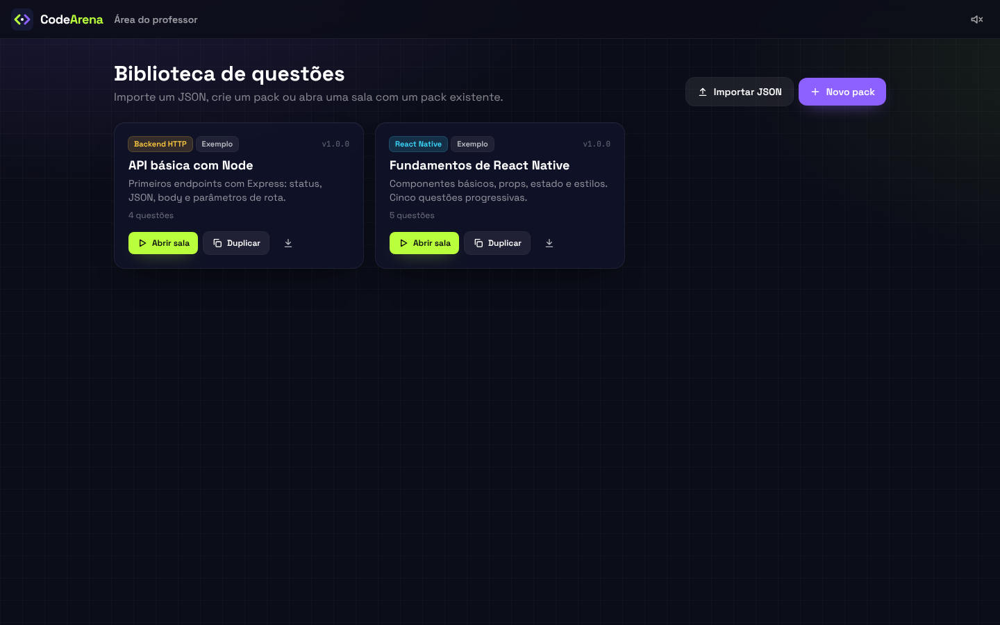
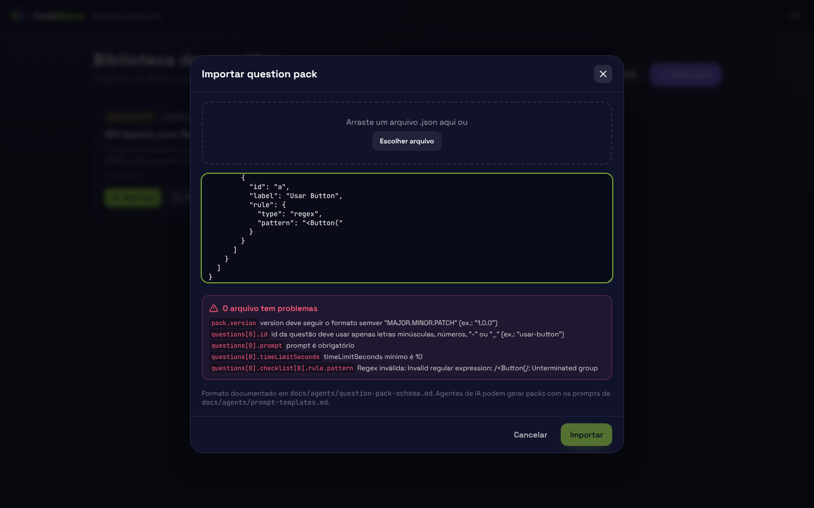
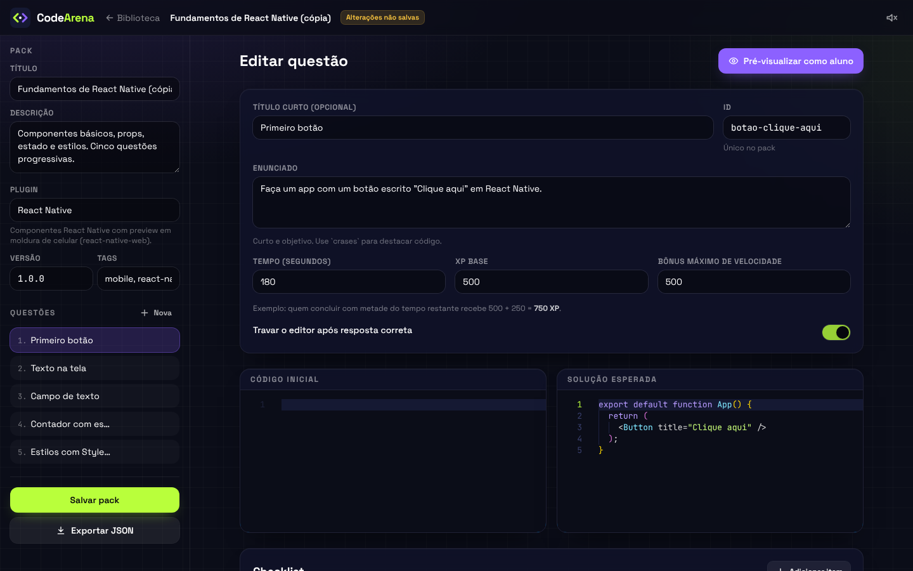
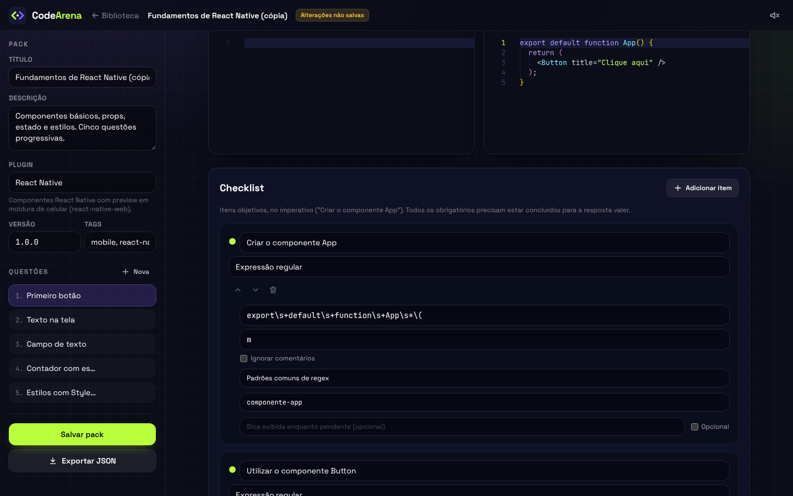
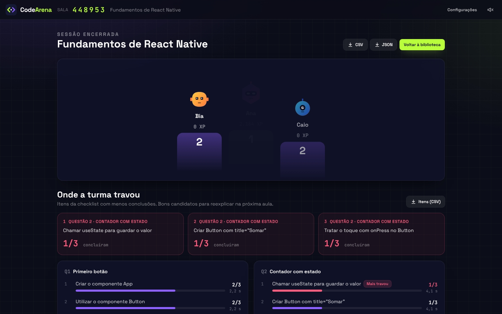
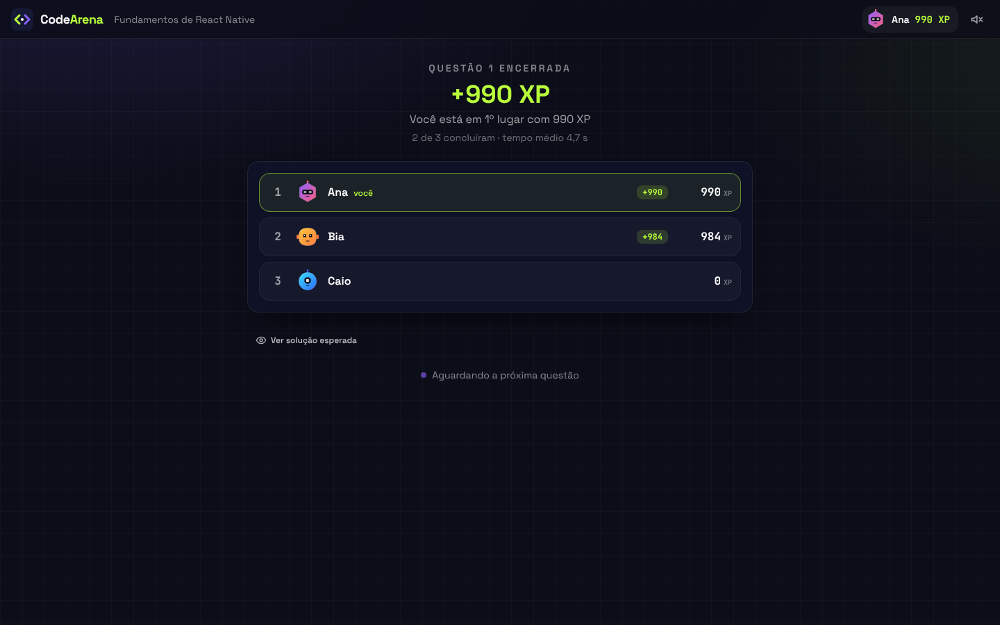
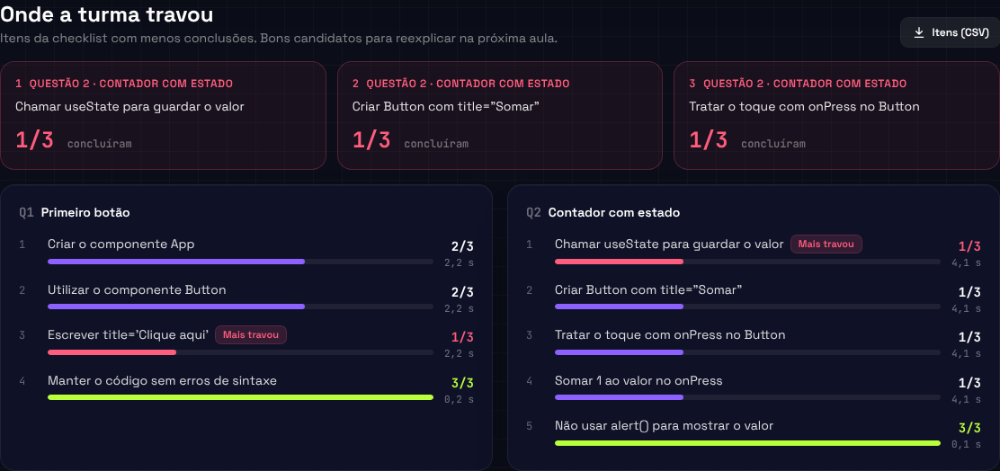

# Guia de autoria para professores

## Três formas de criar conteúdo

1. **Importar JSON** - Biblioteca > Importar JSON. Cole o conteúdo ou arraste o arquivo.
   O app valida antes de salvar e lista cada campo incorreto (ex.: `questions[0].checklist[1].rule.pattern: Regex inválida`).
2. **Editor manual** - Biblioteca > Novo pack, ou Duplicar um pack de exemplo.
3. **Agente de IA** - use os prompts de `docs/agents/prompt-templates.md` e importe o JSON gerado.

Packs de exemplo (marcados "Exemplo") são somente leitura: use "Duplicar" para adaptar.
Qualquer pack pode ser exportado como JSON (ícone de download) para versionar, compartilhar ou reimportar.

Todo pack depende de um plugin (`react-native`, `backend-http` ou outro), que precisa estar instalado no servidor
do CodeArena que você usa. Para usar um plugin novo ou compartilhar packs com outros professores, veja
[Plugins e packs: como funciona](../guia/plugins-e-packs.md).

## Editor manual

Para cada questão:

- **Enunciado, tempo e XP.** O editor mostra quanto XP vale uma resposta com metade do tempo restante.
- **Código inicial e solução esperada.** A solução é revelada aos alunos ao fim da questão.
- **Checklist.** Para cada item: texto (no imperativo), tipo de regra, parâmetros, dica opcional e se é opcional.
  - "Padrões comuns de regex" preenche padrões robustos: exporta componente, usa componente, define prop, cria rota, retorna status, importa módulo, função assíncrona.
  - "Validador do plugin" lista os validadores disponíveis com descrição e parâmetros de exemplo.
- **Testar a checklist.** Edite o código de teste (comece com "Usar solução") e veja cada item marcar ao vivo.
  "Validar no servidor" roda exatamente a validação usada nas salas.
- **Qualidade da questão.** Avisos automáticos: solução que não completa a checklist, código inicial que já completa,
  regex que aceita texto vazio, textos curtos demais.
- **Pré-visualizar como aluno.** Abre a tela do aluno com editor, checklist e preview, sem cronômetro.

## Conduzindo a aula

1. Biblioteca > Abrir sala: escolha as questões e as opções (modo discreto, bônus de sequência).
2. Projete a tela do lobby: ela mostra o endereço e o código de 6 dígitos.
3. "Iniciar questão" dispara uma contagem de 3 s para todos.
4. Durante a questão você vê quantos itens cada aluno concluiu e, em "Itens da checklist, ao vivo", quantos alunos já concluíram cada item. Nunca aparece o código.
5. A questão termina quando todos os conectados acertam, quando o tempo acaba ou em "Encerrar questão agora".
6. O placar mostra XP ganho, mudança de posição e a solução esperada.
7. "Encerrar sessão" gera o relatório (XP, acertos, tempo médio por aluno e acertos por questão), exportável em CSV e JSON.

**Modo discreto:** alunos veem só o top 3 e a própria posição, sem pódio. Use quando a competição aberta puder constranger.

## Telas do fluxo do professor

Biblioteca de packs, com os plugins de cada um e as ações abrir sala, editar, duplicar e exportar:

Importação de JSON: cada problema aparece com o caminho exato do campo, antes de qualquer coisa ser salva:

Editor de questão (enunciado, tempo, XP, código inicial e solução) e, abaixo, a checklist com teste ao vivo e avisos de qualidade:

Sala: lobby com o código, acompanhamento por aluno (sem mostrar código), placar e relatório final:

Visão do aluno na mesma sessão:

## Questões de depuração

Além de "construir do zero", o editor tem o tipo **Depurar**: o código inicial é um código com bug e a checklist verifica o
comportamento depois da correção. Escreva o sintoma no enunciado, não a causa.

- O aluno vê a faixa **Depuração**, pode abrir **Ver o que mudei** (diff com o original) e **Restaurar original**.
- O editor avisa se o bug não é detectado: *"O código com bug já cumpre todos os itens"*. Para ter certeza, use
  "Usar código com bug" em "Testar a checklist" e veja quais itens ficam pendentes.
- Itens que já passam no código com bug são **proteção** ("a rota continua registrada") e impedem consertos que apagam tudo.
- Ao fim da questão, a correção esperada aparece como diff.

Há dois packs prontos para usar ou duplicar: `Depuração em React Native` e `Depuração de APIs com Express`.
Guia completo (inclusive para agentes de IA): [`docs/agents/debug-questions.md`](../agents/debug-questions.md).

## Revisão da turma: onde cada item travou

A checklist mostra exatamente em que passo cada aluno parou, então o app transforma isso em um diagnóstico da turma.

**Ao vivo.** Cada item mostra quantos alunos o concluíram naquele momento. Se a barra de um item fica curta enquanto as anteriores enchem,
a turma está travada nele: é a hora de dar uma dica em voz alta ou de encerrar a questão.

**Ao fim de cada questão.** O painel "Onde a turma travou" aponta o item mais difícil (menor taxa de conclusão; empate pelo maior tempo)
e mostra a mediana de tempo até cada item ser concluído pela primeira vez.

**No relatório final.** Os três itens mais difíceis da sessão, com a questão de origem, e o detalhe de todas as questões.
O botão "Itens (CSV)" exporta `questao, titulo, item, concluiram, alunos, tempo_mediano_s` para planilhas.

Como é calculado: um item conta como concluído quando o aluno o tem concluído **no fim da questão**. Alunos que enviaram resposta aceita
contam todos os itens; para os demais vale o último estado informado pelo navegador, somado ao que o servidor confirmou em envios recusados.
O contador do navegador é informativo (serve só ao professor); a pontuação continua dependendo apenas da validação do servidor.
Só ids de itens trafegam, nunca o código do aluno.

## Boas práticas

- 3 a 6 questões por aula curta; aumente a dificuldade aos poucos.
- Cada item da checklist deve ser algo que o aluno reconhece no próprio código.
- Teste com a solução **e** com uma resposta errada plausível antes da aula.
- Prefira validadores do plugin a regex quando houver um adequado.
